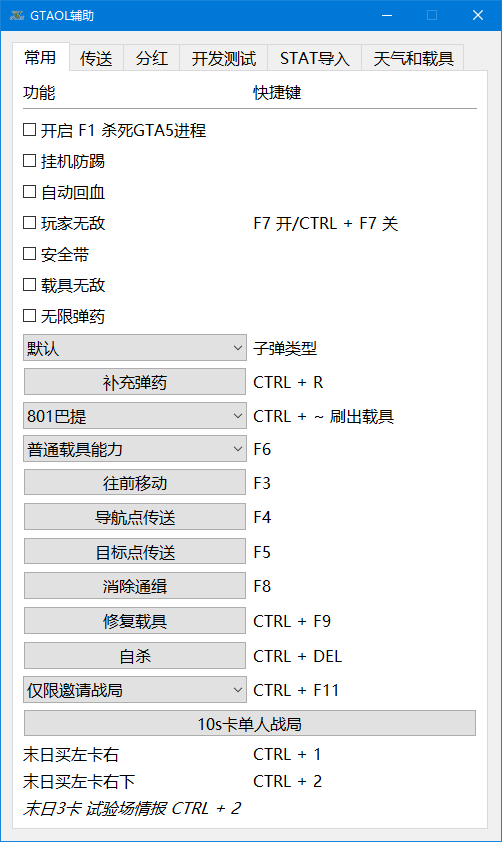
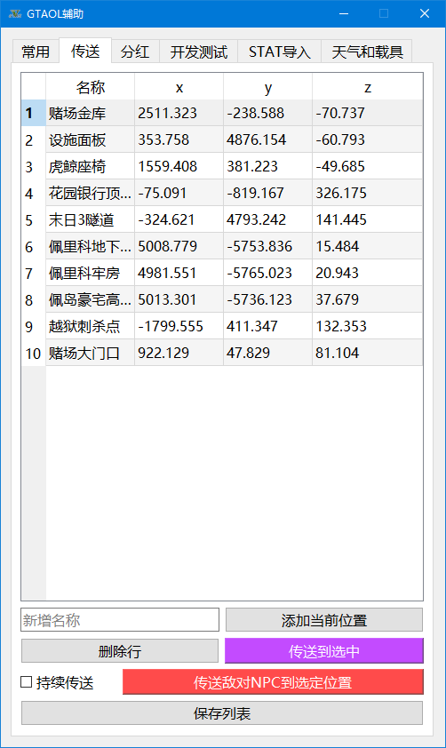
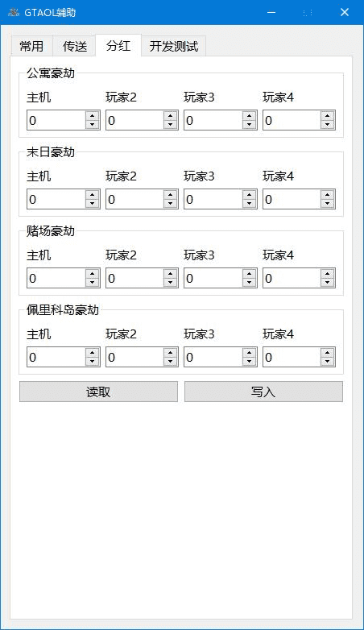

# gta5cheat

适用于 GTA5v1.67

Applicable for GTA5v1.67

## 开发环境 Development Environment

### PYTHON

> pip install pyinstaller pyqt5 pyqt5-tools cffi

keyboard 键盘事件库不好处理scankey，改用c++

### C++

MinGW

CMake

## 编译 Building

* 编译生成项目需要用到的dll文件

> cmake -G "MinGW Makefiles" -S gtaLib -B gtaLib/build

> cmake --build gtaLib/build

* 编译生成exe程序启动文件

> pyinstaller -w ./src/app.py --uac-admin -i icon.ico --version-file=version_info.txt -n="GTAV Cheat" --add-data="teleports.txt;./" --add-binary="./gtaLib/build/lib/gtaLib.dll;./"

## 文档 Documents

* src

  * app.py - 程序入口
  
  * app.ui - QtDesigner ui文件
  
  * Doomsday.py - 卡末日前置模块[❌弃用，供参考]
  
  * gtav.py - 核心数据控制模块
  
  * KeySend.py - 自动按键模块[❌弃用，供参考]
  
  * ProcessMemoryHandle.py - 进程内存模块[❌弃用，供参考]
  
  * resource_rc.py - 静态资源模块
  
  * ui_app.py - ui生成的程序界面模块
  
  * work.py - 子线程类模块

* resource
  
  * icon_16.ico
  
  * resource.qrc
  
  * sound0.wav
  
  * sound1.wav
# C++ Qt6版本

C++ Qt6版本转到[https://github.com/ssyatelandisi/gta5cheat_qt](https://github.com/ssyatelandisi/gta5cheat_qt)

