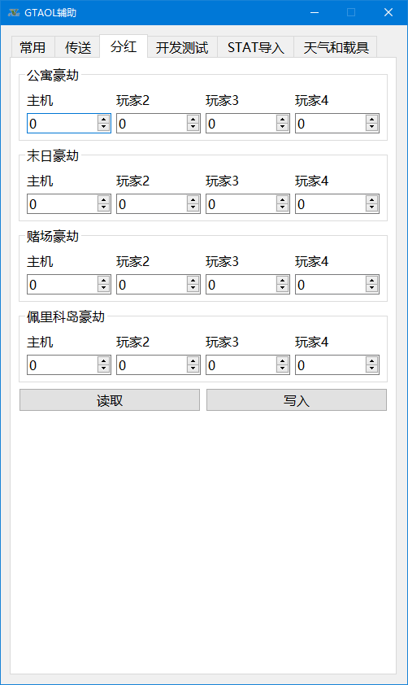

# gta5cheat

适用于 GTA5v1.61

Applicable for GTA5v1.61

## 开发环境 Development Environment

### PYTHON

> pip install pyinstaller pyqt5 pyqt5-tools cffi

keyboard 键盘事件库不好处理scankey，改用c++

### C++

MinGW

## 编译 Building

* 编译生成项目需要用到的dll文件

> cd cpp && build_dll.cmd

* 编译生成exe程序启动文件

> pyinstaller -Fw src/app.py -i icon.ico --version-file=version_info.txt -n="GTAV Cheat" --clean -y

## 文档 Documents

* app.py - 程序入口

* Doomsday.py - 卡末日前置模块[弃用，供参考]

* gtaui.py - 程序界面模块

* GTA5.py - 核心数据控制模块

* KeySend.py - 自动按键模块[弃用，供参考]

* resource_rc.py - 静态资源模块
